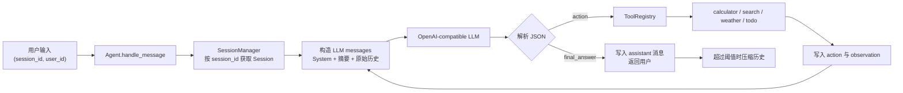

# Agent Demo

一个不依赖 Agent 编排框架的最小 Agent Runtime 示例。它通过 OpenAI 兼容的 `/chat/completions` 接口驱动模型，以 JSON 协议完成 `Thought → Action → Observation` 循环，并提供会话隔离、工具调用和上下文压缩。

> 当前的 `search` 与 `weather` 都是 mock 数据；项目不是联网搜索或真实天气服务。Memory 也不是向量检索/RAG，而是会话历史、会话状态和摘要压缩。

## 运行方式

### 前置条件

- Python 3.12+（项目声明的最低版本）
- [uv](https://docs.astral.sh/uv/)；仓库已包含 `uv.lock`
- 一个 OpenAI Chat Completions 兼容接口的模型配置

在项目根目录创建 `.env`（只保存在本机，不要提交密钥）：

```dotenv
AGENT_MODEL_NAME=your-model-name
AGENT_API_KEY=your-api-key
# 可选；省略时使用 https://api.openai.com/v1
AGENT_BASE_URL=https://api.openai.com/v1
```

安装锁定依赖并运行演示：

```powershell
uv sync --locked
uv run python main.py
```

演示会用同一 `SessionManager` 创建两个 session，分别执行天气/待办与计算/待办操作，再回到第一个 session 追问，以验证会话历史和待办状态不会串扰。

运行测试：

```powershell
uv run python -m unittest discover -s tests -v
```

如果虚拟环境已存在，也可在 Windows 下直接执行：

```powershell
.\.venv\Scripts\python.exe main.py
.\.venv\Scripts\python.exe -m unittest discover -s tests -v
```

## 系统设计



- `main.py` 负责装配默认工具注册表、`SessionManager` 和 `Agent`，并运行两窗口示例。
- `agent_core/agent.py` 实现主循环。每轮最多 5 次 LLM/工具迭代；模型必须只输出以下二选一 JSON：

  ```json
  {"thought": "...", "final_answer": "..."}
  ```

  ```json
  {"thought": "...", "action": {"tool": "工具名", "args": {}}}
  ```

  无法解析的输出、未知工具和工具错误会被记录；达到步数上限后会返回兜底信息，避免无限循环。

- `agent_core/tools.py` 以 `ToolRegistry` 管理工具名称、描述、参数 schema 和实现。工具 schema 被序列化进 system prompt，由模型选择工具。`calculator` 仅允许 AST 白名单中的基础运算；`search`、`weather` 为 mock；`todo` 修改当前会话状态。
- `agent_core/context.py` 定义 `Session`、`SessionManager`、消息、执行轨迹和压缩策略。会话目前仅保存在进程内存；重启进程后历史、待办和 trace 都会丢失。
- `agent_core/llm_client.py` 用同步 HTTP POST 调用 `${AGENT_BASE_URL}/chat/completions`，默认 `temperature=0`、`max_tokens=800`、超时 30 秒。

## Memory：召回时机与放置方式

### 1. 会话消息记忆（自动、每次模型调用）

用户消息刚进入 `handle_message()` 时会先追加到 `Session.messages`。随后，**每一次** LLM 调用（包括工具调用后的下一步）都会由 `_build_messages()` 重建上下文，顺序固定为：

1. system prompt：角色、可用工具 schema、JSON 输出协议；
2. 若有压缩摘要：一条额外的 `system` 消息；
3. 当前 session 保留的原始消息，按时间顺序追加。

原始 `tool` 消息不直接以 `tool` role 发送，而是转成带 `[工具 <name> 的执行结果]` 标记的 `user` 消息。这样模型在下一次决策时能看到 observation。不同 `session_id` 持有完全独立的 `messages`，所以不会召回其他窗口的对话。

### 2. 会话状态记忆（按需、通过工具召回）

待办存放在 `Session.todos`，同样以 `session_id` 隔离。它**不会**自动拼入 prompt；只有模型判断需要时调用 `todo` 工具，工具才读取或修改该列表，并将结果作为 observation 写回消息历史，供下一次 LLM 调用使用。

`Session.trace` 存放每一步的 thought、action 和 observation，服务于调试/审计，当前不会注入 LLM 上下文。

### 3. 长对话摘要记忆（阈值触发）

`maybe_compress()` 在一轮成功给出最终答案后，或因达到工具步数上限而结束时调用。触发条件是 `len(session.messages) > 20`：

- 保留最新 12 条原始消息；
- 将更早的消息与已有摘要交给 `_summarize()`，生成新的累计摘要；
- 丢弃这些更早的原文；
- 在后续请求中把摘要放在主 system prompt **之后**、原始历史 **之前** 的 system 消息中。

因此首次触发通常发生在第 21 条消息：会摘要前 9 条、保留后 12 条。该策略控制 prompt 长度，但不会按语义、关键词或向量相似度检索历史；被压缩细节是否可用取决于摘要质量。若需要跨会话/跨进程记忆、精确历史召回或用户级长期记忆，需要另加持久化存储与检索层。

## 目录

```text
.
├── main.py                 # 两个会话的运行示例
├── agent_core/
│   ├── agent.py            # Agent 循环与上下文组装
│   ├── context.py          # Session、memory、摘要压缩
│   ├── tools.py            # 工具注册表和内置工具
│   └── llm_client.py       # OpenAI 兼容 LLM 客户端
└── tests/                  # Agent、context、tools 单元测试
```
